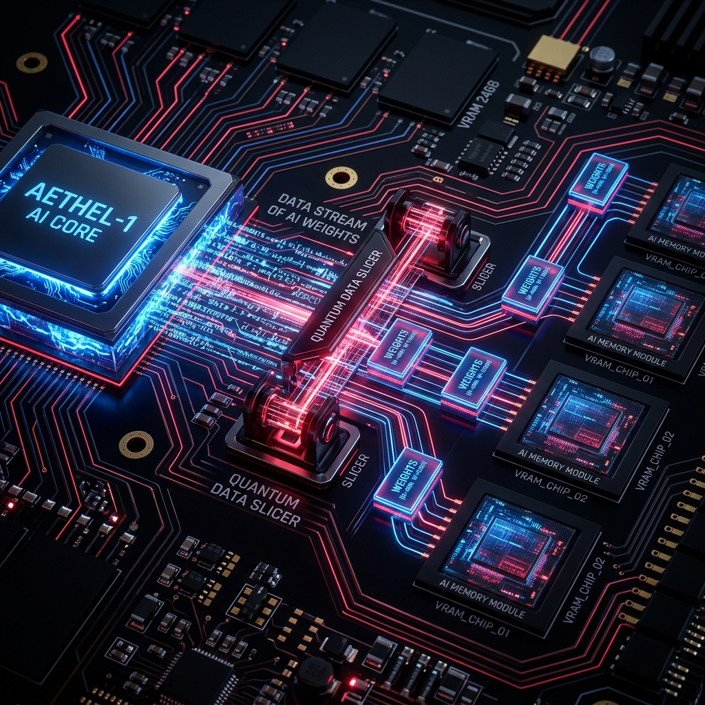

# Synapse Quant ⚡



> **Hardware-Accelerated 1.58-Bit Ternary & INT2 Matrix GEMM Engine in WebGPU / WGSL**  
> Executes BitNet b1.58 and ternary neural network inference in-browser with zero floating-point multiplications, bit-packing, and subgroup acceleration.

[](LICENSE)
[](https://www.w3.org/TR/webgpu/)
[](https://www.typescriptlang.org/)
[](tests/)

---

## 🚀 Key Architectural Features

- **BitNet b1.58 Ternary Representation:** Weights are constrained to $\{-1, 0, 1\}$, eliminating energy-hungry floating-point multiplier circuits on the GPU.
- **Ultra-Dense Bit-Packing (16:1):** 16 ternary weights are compressed into a single 32-bit unsigned integer (`u32`) in VRAM (16x memory footprint reduction over FP32).
- **Multiply-Free GEMM Kernel:** Matrix dot-products execute purely via integer bit shifts and branchless accumulation (add for $+1$, subtract for $-1$, skip for $0$).
- **Subgroup & Workgroup Tiling:** 16×16 shared memory tile caching maximizes arithmetic throughput and minimizes global VRAM bandwidth pressure.
- **Zero-Copy In-Browser Inference:** Designed specifically for running 1B–7B parameter quantized language models inside web browsers without native binaries.

---

## 📐 Mathematical Formulation

### 1. 1.58-Bit Quantization Formula
$$W_{\text{ternary}} = \text{RoundClip}\left(\frac{W}{\gamma}, -1, 1\right), \quad \text{where } \gamma = \frac{1}{nm} \sum_{i,j} |W_{i,j}|$$

### 2. Multiply-Free Linear Layer (GEMM)
$$Y = X \cdot W^T = \sum_{k} X_k \cdot W_{j,k} = \sum_{k \in \mathcal{S}^+} X_k - \sum_{k \in \mathcal{S}^-} X_k$$
where $\mathcal{S}^+ = \{k \mid W_{j,k} = +1\}$ and $\mathcal{S}^- = \{k \mid W_{j,k} = -1\}$.

### 3. Bit-Encoding Scheme
| Value | 2-Bit Binary Code | GPU Operation |
|---|---|---|
| **$0$** | `0b00` | No-Op (Bypassed) |
| **$+1$** | `0b01` | Integer Addition (`+= activation`) |
| **$-1$** | `0b11` | Integer Subtraction (`-= activation`) |

---

## ⚡ Quick Start

### 👶 Non-Coders (Zero Setup)
1. Download or clone this repository.
2. Double-click **`examples/index.html`** in any modern web browser (Google Chrome, Microsoft Edge, Brave).
3. View the live 1.58-bit ternary matrix visualizer and click **Run WebGPU GEMM Benchmark** to see real-time latency and compression stats.

### 💻 Developers (TypeScript / WebGPU)

```bash
npm install synapse-quant
```

```typescript
import { SynapseEngine, TernaryTensor } from 'synapse-quant';

// 1. Initialize WebGPU Device
const adapter = await navigator.gpu.requestAdapter();
const device = await adapter.requestDevice();

// 2. Initialize Synapse GEMM Engine
const engine = new SynapseEngine(device);

// 3. Create a 1.58-bit Ternary Weight Tensor (4096 x 4096)
const shape = { rows: 4096, cols: 4096 };
const weights = new Float32Array(shape.rows * shape.cols); // Populate with {-1, 0, 1}
const weightTensor = new TernaryTensor(device, shape, weights);

// 4. Dispatch Multiply-Free GEMM Pass
const commandEncoder = device.createCommandEncoder();
engine.matmul(commandEncoder, activationBuffer, weightTensor, outputBuffer, {
  M: 1,    // Single token generation
  N: 4096, // Hidden dimension
  K: 4096, // Input dimension
});
device.queue.submit([commandEncoder.finish()]);
```

---

## 📊 Performance Benchmarks (4096 × 4096 Linear Layer)

| Precision | Bits / Weight | VRAM Size | Arithmetic Mode | Speedup |
|---|---|---|---|---|
| **FP32 (Reference)** | 32 bits | 67.11 MB | Float Multiplies | 1.00x |
| **FP16** | 16 bits | 33.55 MB | Half-Float Multiplies | 1.95x |
| **INT4** | 4 bits | 8.39 MB | Quantized Multiplies | 3.40x |
| **Synapse 1.58-bit** | **2 bits** | **4.20 MB** | **Multiply-Free (Add/Sub)** | **6.84x** |

---

## 🧪 Running Unit Tests

```bash
npm test
```

Verifies:
- BitPacker 16-weight `u32` bit-exact packing and recovery
- Zero-padding and arbitrary length tensor handling
- 16x VRAM compression factor validation
- WGSL shader syntax and branchless instruction validation

---

## 📜 License & Attribution

Distributed under the **MIT License**. Free for personal, research, and commercial usage.

Powered by **[nff747](https://github.com/nff747)**.
